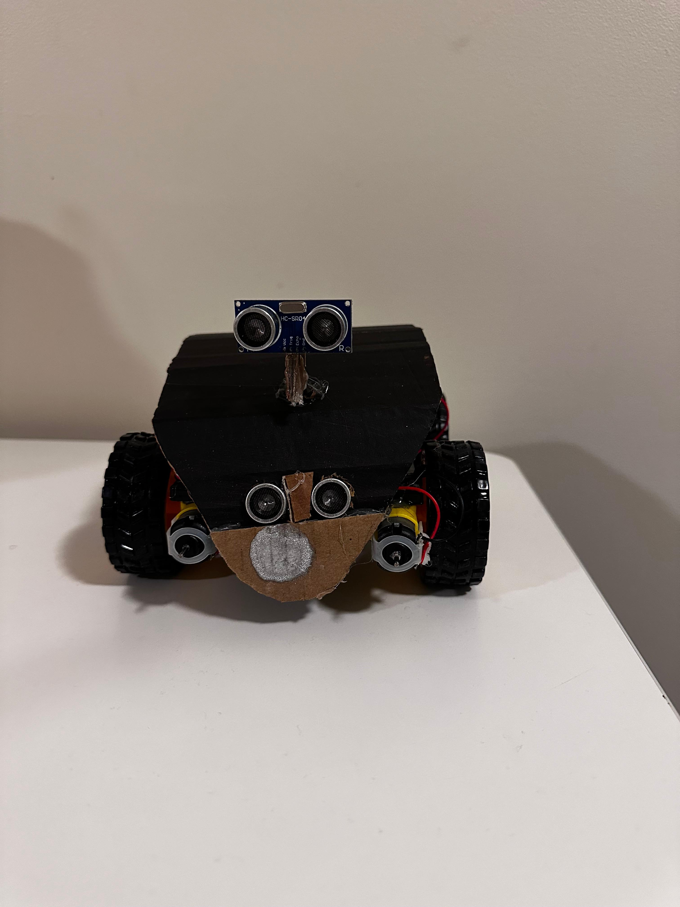
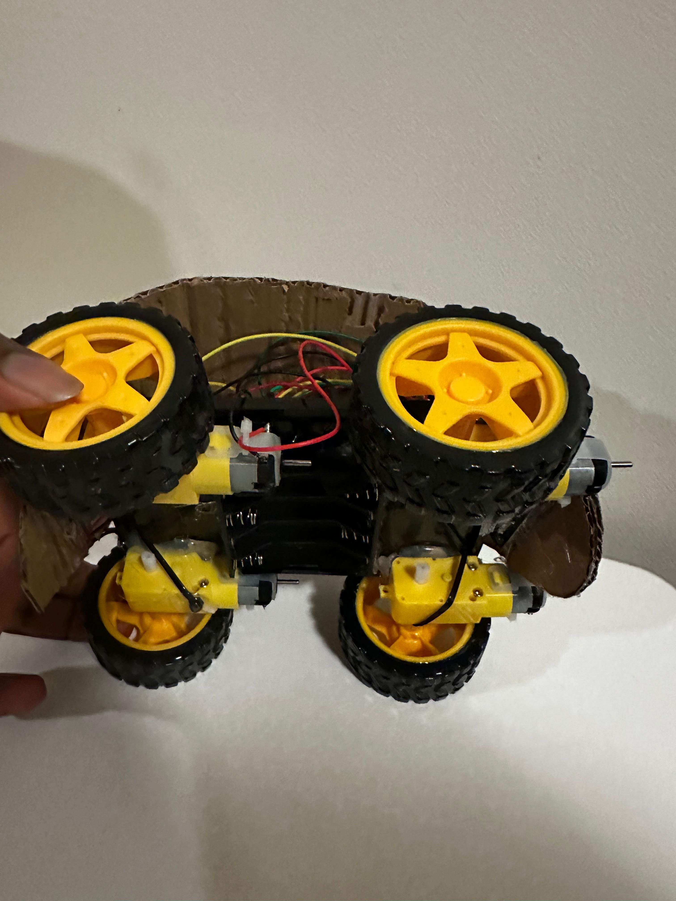
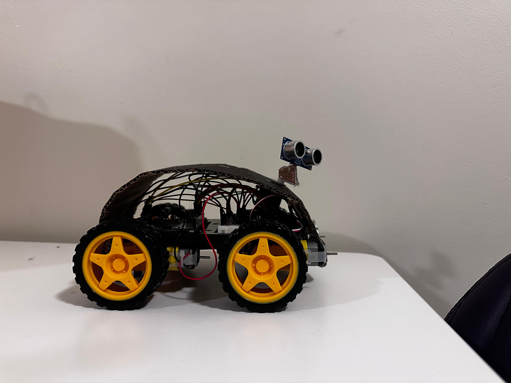

# RekasBot

**RekasBot** is an innovative bot that I developed, combining hardware and software to create a smart, gesture-controlled robot. The bot is designed using components from an Arduino kit, programmed with the Arduino IDE, and leverages hand gestures for control, made possible by the P5.ml machine learning library.

## Features

### Hardware
- **4 DC Motors**: Drives the bot forward, backward, and turns with ease.
- **2 Ultrasonic Sensors**: Used for obstacle detection and avoidance.
- **LED Indicators**: Provide visual feedback for turns and warnings.
- **Sound Alerts**: Alerts for potential danger or obstacles in the way.

### Software
- **Arduino IDE**: Configured the hardware components using custom code.
- **P5.js with P5.ml**: Programmed the user interface and integrated hand gesture controls for an intuitive, contactless experience.

## Project Structure
RekasBot is divided into two key components:
1. **Hardware**: Built entirely from components within an Arduino kit, wired and assembled for optimal functionality.
2. **Software**: The gesture-controlled interface, programmed using P5 and powered by the P5.ml library.

## How It Works
With the help of **hand gestures**, you can seamlessly control RekasBot’s movement, using the virtual steering interface. The system responds to the gestures, guiding the bot to navigate through its environment while avoiding obstacles and signaling turns or alerts.

---

## Building RekasBot

The journey of creating RekasBot from scratch:

---

## Photos of RekasBot

Here's a look at RekasBot in its final form:

  
  

---

## Testing RekasBot

Watch as I put RekasBot through a series of tests to ensure it works perfectly:

---

## User Experience

See how users interact with RekasBot using hand gestures to control its movements:

---

## Getting Started

1. Upload the <a href='./FinalProject.ino'>Arduino file</a> to your Arduino board.
2. Run the P5.js sketch to initialize the hand gesture interface.
